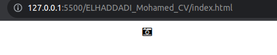
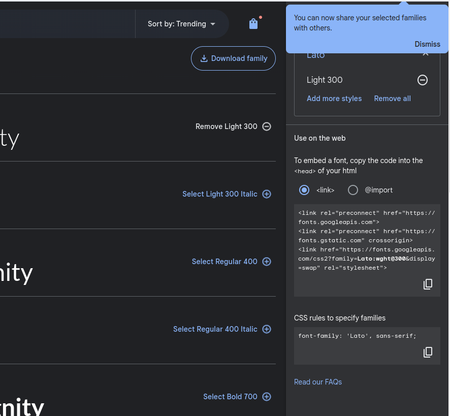
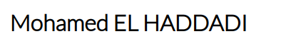
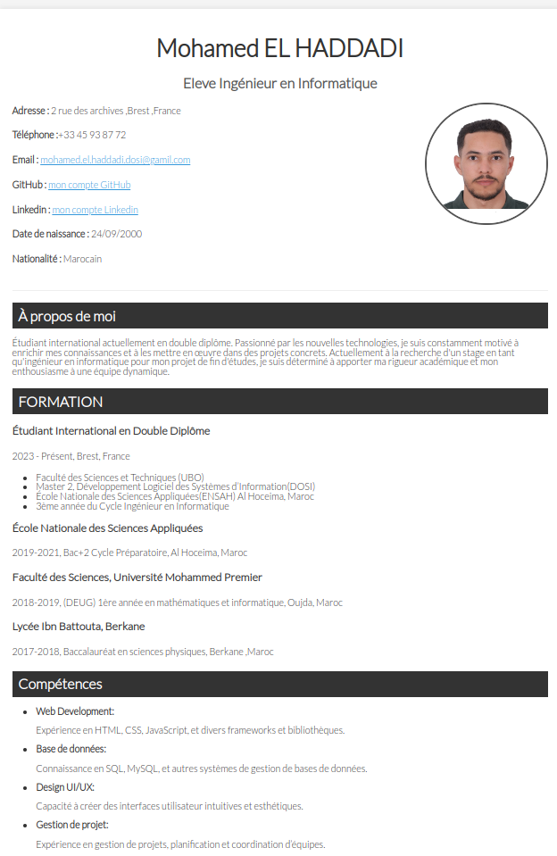

# ELHADDADI_Mohamed_CV
## 1. structure HTML
### 1.1. un cv struturer (mais un peu moche )

#### 1. la page ubo_resume.html
```html
<!DOCTYPE html>
<html lang="fr">

<head>
      <meta charset="UTF-8">
      <title>CV</title>
      <meta http-equiv="X-UA-Compatible" content="IE=edge">
      <meta name="description" content="A propos de moi">
      <meta name="keywords" content="web , devlopper, spring boot , java, html , css ">
      <meta name="author" content="ELHADDADI Mohamed">
      <meta viewport="width=device-width, initial-scale=1.0">
      <link rel="stylesheet" href="css/style.css">
</head>
<body>
      <div id="wrapper">
            
      </div>
</body>
```
#### 1. Ajouter un bloc header contenant :
```html
  <header>
                  <h1>Mohamed EL HADDADI</h1>
                  <h2>Developpeur Web</h2>
                  
                  <section>
                        <h2>Information personnelle</h2>
                        <div>
                              <p><span>Adresse :</span> 1 rue de la paix 75000 Paris</p>
                              <p><span>Téléphone :</span>+33 45 93 87 72</p>
                              <p><span>Email :</span>
                                    <a href="mailto:mohamed.el.haddadi.dosi@gmail.com">
                                          mohamed.el.haddadi.dosi@gamil.com</a>
                              </p>
                              <p><span>GitHub :</span>
                                    <a href="https://github.com/Medhaddadi">
                                          mon compte GitHub</a>
                                    </a>
                              <p>
                                    <span>Linkedin :</span>
                                    <a href="https://www.linkedin.com/in/mohamed-el-haddadi-879b8b217/">
                                          mon compte Linkedin</a>
                                    </a>
                              </p>
                              <p>
                                    <span>Date de naissance :</span> 24/09/2000
                              </p>
                              <p>
                                    <span>Nationalité :</span> Marocain
                              </p>

                        </div>
                  </section>
            </header>
```
### 3. Ajouter des sections pour le contenu de votre CV par exemple un texte de présentation, une section expériences professionnelles (penser à <article>), la liste de vos compétences (penser à ), une section formation, langues, hobbies, etc.

```html
      <article>
            <h2>Loisirs</h2>
            <dl>
                <dt>Sport</dt>
                <dd>Pratique régulière du football et du tennis.</dd>
                <dt>Résolution de problèmes</dt>
                <dd>Participation à des compétitions de programmation et de mathématiques.</dd>
                <dt>Jeux vidéo</dt>
                <dd>Passionné par les jeux de stratégie et les simulateurs de vol.</dd>
                <dt>Lecture</dt>
                <dd>Lecteur assidu de littérature classique et de science-fiction.</dd>
            </dl>
        </article>
```

### 1.1. un peu de style 

#### 1.1.1. & 2 ajouter un fichier css/style.css

```html
<link rel="stylesheet" href="css/resume.css">
```

#### 1.1.3. modifier le style css 


```html
<i class="fa fa-camera-retro"></i>
```

```css
html{

      font-size: 1em;
      line-height: 1.4;
      /* background-color: #777; */
}
#wrapper{
      max-width: 900px;
      min-width: 320px;
      margin:  auto;
}

header img {
  float: right;
  border: 1px solid #ccc;
  border-radius: 3px;
  box-shadow: 0 2px 4px rgba(0, 0, 0, 0.2);

}

header h1 {
  font-family: 'Lato', sans-serif;
}

```

### 1.1.4 police d'icon font awesome
      
```html
<link rel="stylesheet" href="https://cdnjs.cloudflare.com/ajax/libs/font-awesome/4.7.0/css/font-awesome.min.css">
```

### 1.1.4. b test de font awesome 

```html
<i class="fa fa-camera-retro"></i>
```


### 1.1.5. recharger le  police 

#### 1.1.5. a. En ajoutant le lien suivant dans le head de votre page HTML :

en va utiliser le site [google font](https://fonts.google.com/)

```html
 <link rel="preconnect" href="https://fonts.googleapis.com">
      <link rel="preconnect" href="https://fonts.gstatic.com" crossorigin>
      <link href="https://fonts.googleapis.com/css2?family=Lato:wght@300&display=swap" rel="stylesheet">
```

#### 1.1.5. b. En choisissant la police Lato sur le site Google Fonts :


```css
body {
  font-family: 'Lato', sans-serif;
}
```




### 1.1.6. style le reste de la page 



### 1.1.7 validation des modifications en git adding tag <<CSS>>

```bash
git add .
git commit -m "Ajout de style a la page"
git tag -a CSS -m "CSS"
git push origin CSS

```

  git config --global user.email "mohamed.elhaddadi2@etu.uae.ac.ma"
  git config --global user.name "Mohamed EL HADDADI"
